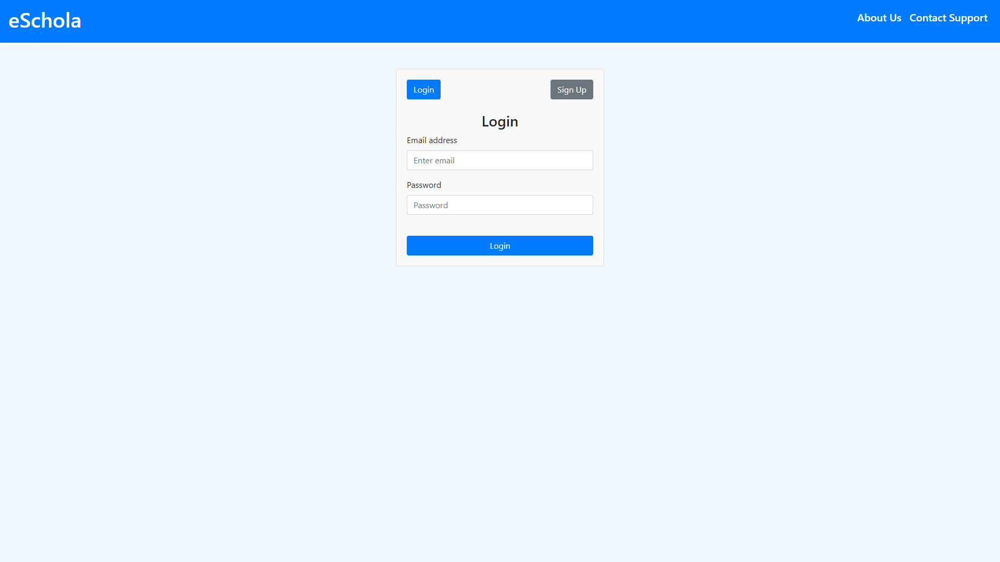
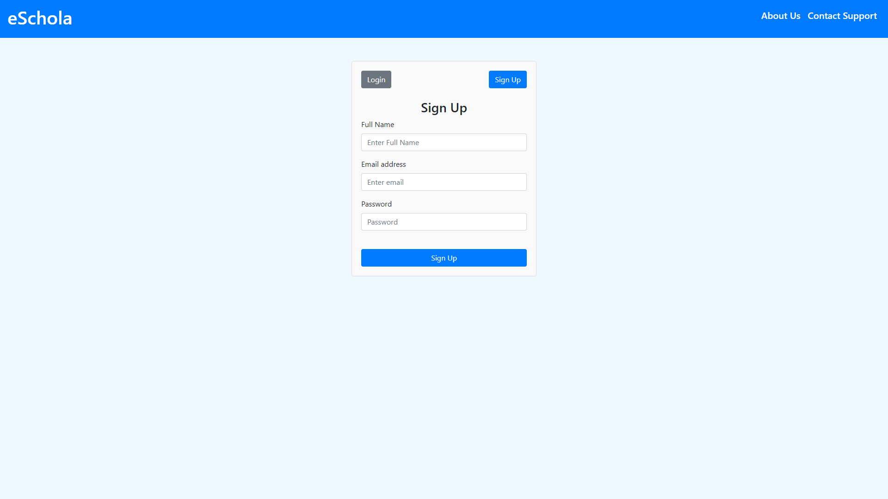
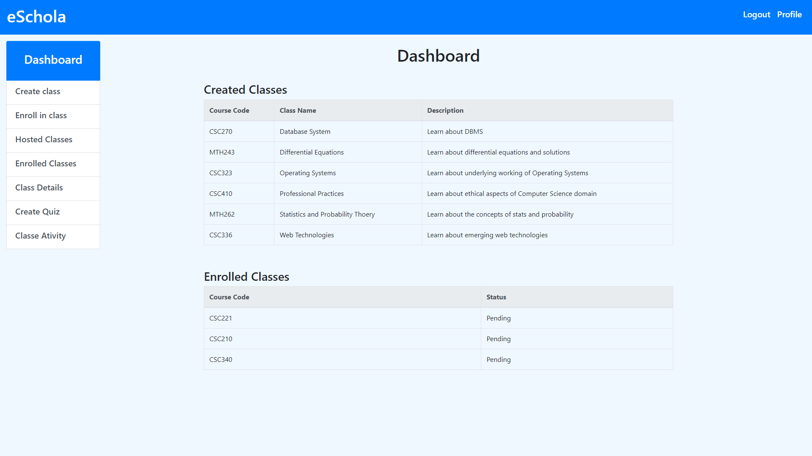
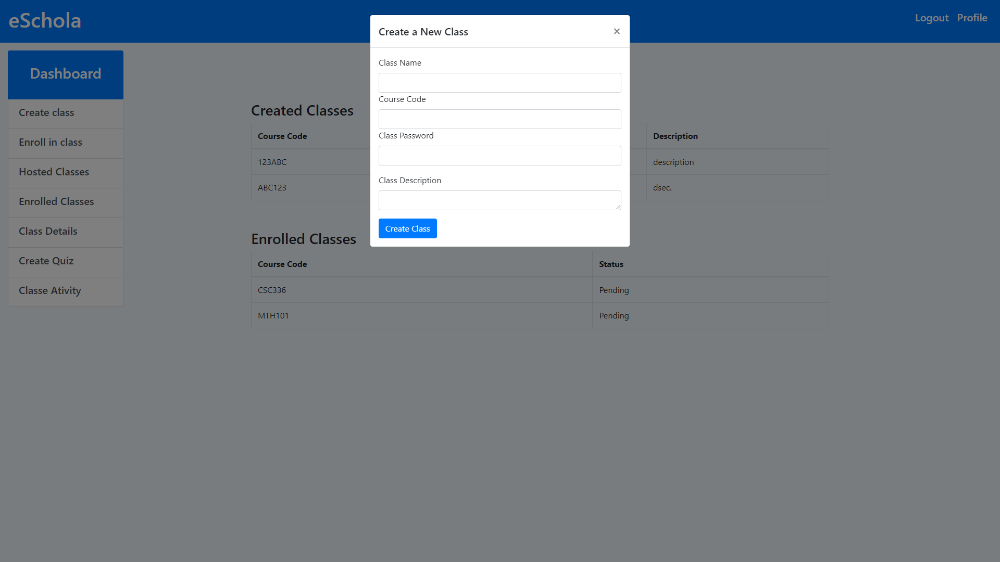
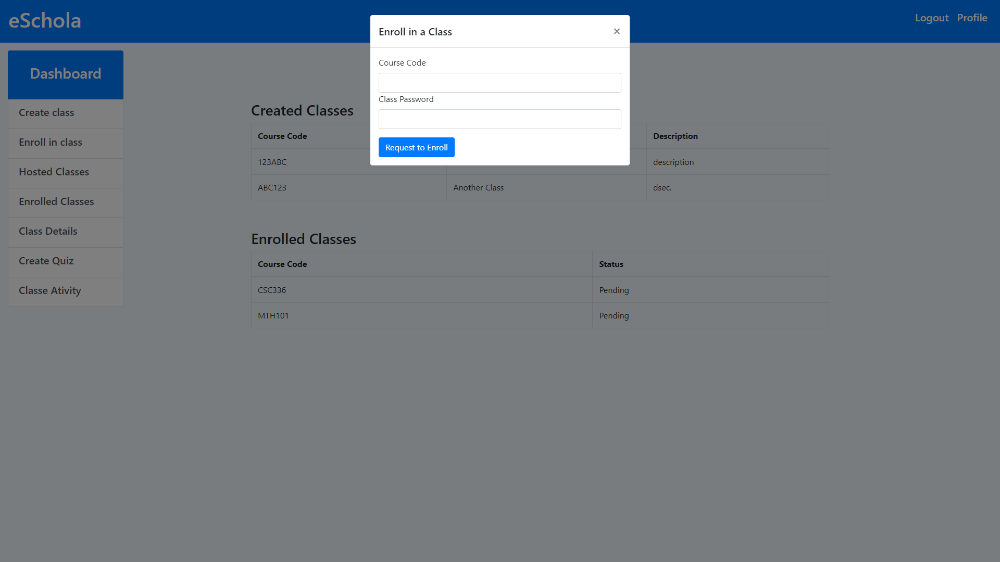
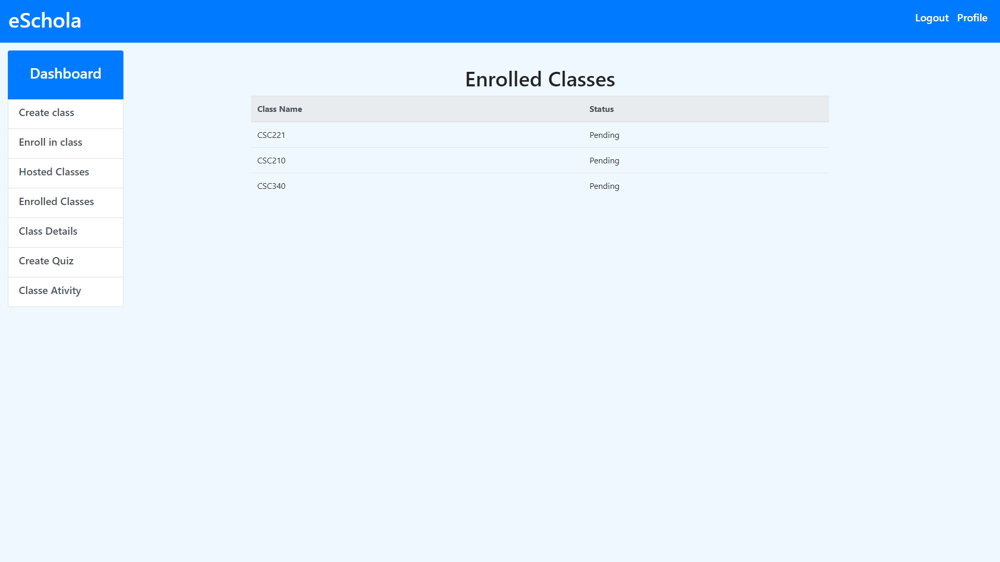
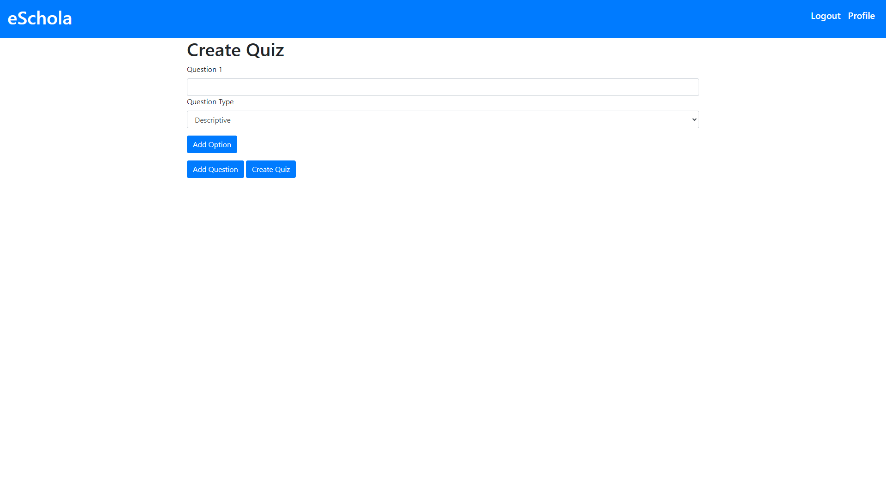
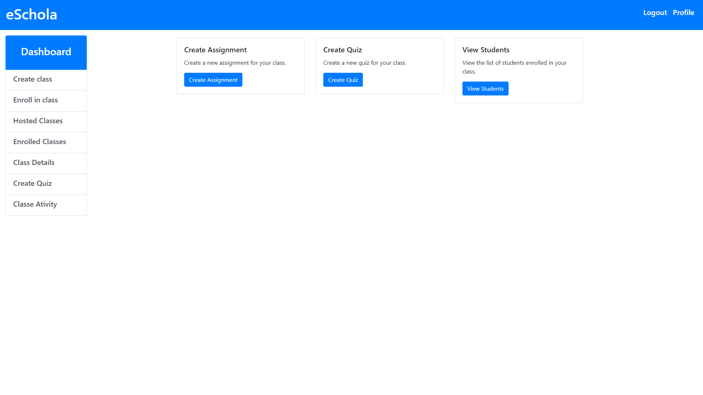
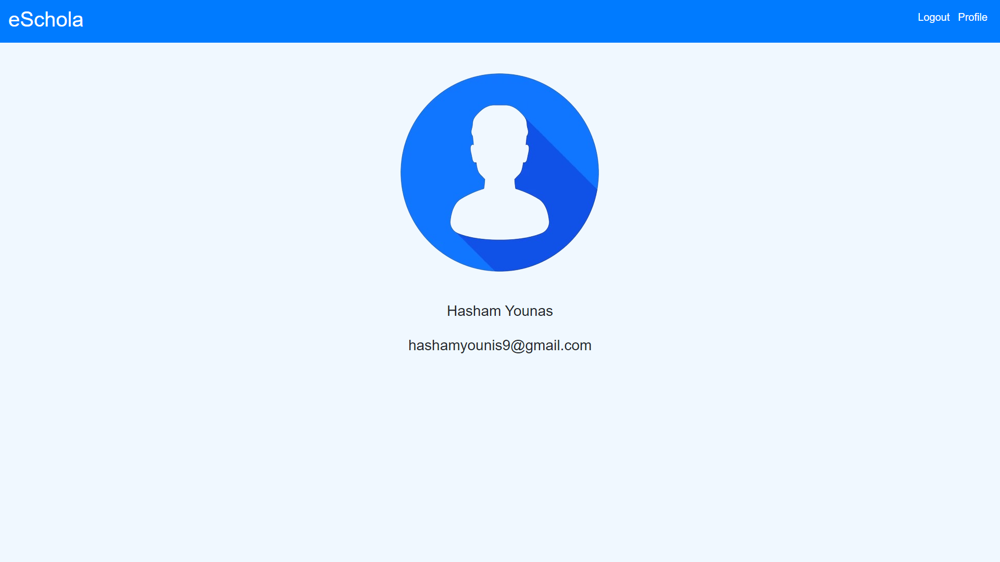

 
# A Virtual Classroom Platform

## Introduction

Here's eSchola, a web-based application designed to empower educators and learners in a dynamic and engaging virtual classroom setting. It offers a comprehensive suite of features to facilitate interactive learning, assessment, and collaboration:

- **Class Creation and Management:** Effortlessly set up classes, define syllabi, and manage student enrollment.
- **Content Delivery and Organization:** Upload and share a variety of learning materials, including text, multimedia, and interactive elements.
- **Assessment Tools:** Create and administer quizzes, assignments, and other assessments to gauge student understanding.
- **Interactive Activities:** Foster active learning with discussions, forums, polls, and other collaborative tools.
- **Dynamic Dashboard:** Gain valuable insights into student performance, course progress, and overall class activity through customizable dashboards.

## Technologies Used

- **Front-End:** HTML, CSS, JavaScript, Bootstrap (for responsive design)
- **Back-End:** Apache (web server), MySQL (database), PHP (server-side scripting)

## Installation

### Prerequisites

Ensure you have a web server (Apache) and a MySQL database server installed and configured on your system.

### Database Setup

1. Create a MySQL database for eSchola.
2. Import the provided `eSchola.sql` file (if included) into the newly created database. This file should contain the necessary tables and schema for the application to function.

### File Permissions

Grant appropriate permissions to the application's files and folders to allow the web server to access them. Typically, these permissions would involve setting the owner and group to the web server user (e.g., `www-data` or `apache` on some systems) and granting read and execute permissions for files and directories. Consult your web server documentation for specific instructions.

### Configuration

Edit the `dbConnect.php` file to provide the following details:
- Database connection information (host, username, password, database name)
- Optionally, you may customize other settings within `dbConnect.php` as needed.

### Running the Application

1. Copy the eSchola application files and folders to your web server's document root directory (usually `http://localhost/` or similar).
2. Access eSchola in your web browser by visiting `http://localhost/eSchola/`.

## Screenshots

### Login

### Sigup

### Dashboard

### Class Management

### Host Classes

### Enrolled Classes

### Create Quiz

### Interactive Activities

### Profile

## Additional Notes

- For enhanced security, consider using a prepared statement approach in your PHP code to prevent SQL injection vulnerabilities.
- Regularly back up your database to ensure data safety in case of unforeseen events.
- Explore advanced features like user authentication, role-based access control (RBAC), and integration with external learning management systems (LMS) or content delivery networks (CDNs) for further scalability and functionality.

## Getting Started

Once eSchola is up and running, you can begin creating classes, enrolling students, and utilizing the various features to create a vibrant online learning environment. Refer to the provided documentation (if available) or explore the application's interface for detailed usage instructions.

## Contributing

If you'd like to contribute to the development of eSchola, feel free to fork the repository (if applicable) and submit pull requests for your code changes. We appreciate your interest in making eSchola even better!

## Disclaimer

This README file is intended to provide a general overview of the eSchola application. Specific installation and configuration steps may vary depending on your system environment. It's recommended to consult your web server's documentation or seek assistance from a system administrator if needed.
